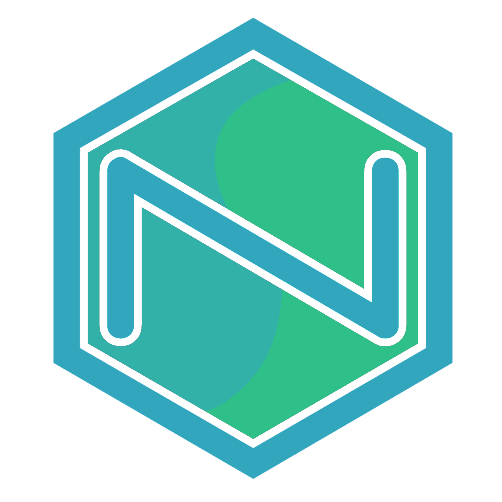

# 🖼️ Projeto de Imagens Dinâmicas



Sistema full stack para **geração e composição de imagens dinâmicas**, com backend em Node.js e frontend em React (Vite).  
Permite combinar imagens base, overlays, textos e estilos via API.

---

## ✅ Pré-requisitos

- Node.js **18+** (recomendado)
- npm
- Git

---

## 🚀 Passo a passo para rodar o projeto

1️⃣ Clonar o repositório

```bash
git clone <URL_DO_REPOSITORIO>
cd <PASTA_DO_PROJETO>

2️⃣ Instalar dependências

npm run install:all

3️⃣ Configurar variáveis de ambiente (.env)

Backend (backend/.env)

Edite o arquivo .env e ajuste tokens, segredos e URLs:

Frontend (/src/lib/api.ts)

Configure a URL da API:

VITE_API_URL=http://localhost:3000

Usando túnel (opcional):

Caso queira expor o projeto externamente (ex: Cloudflare Tunnel, ngrok):

Crie um túnel para o frontend

Crie outro túnel para o backend

Atualize:

FRONTEND_URL no backend

VITE_API_URL no frontend

Reinicie ambos os serviços

4️⃣ Gerar acessos iniciais (usuário/admin)

Antes de rodar o sistema pela primeira vez, é necessário gerar os acessos iniciais.

Rode no terminal:

node backend/setup.js

5️⃣ Iniciar backend e frontend:

npm run dev:all